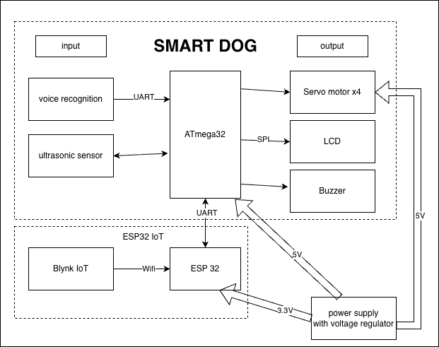
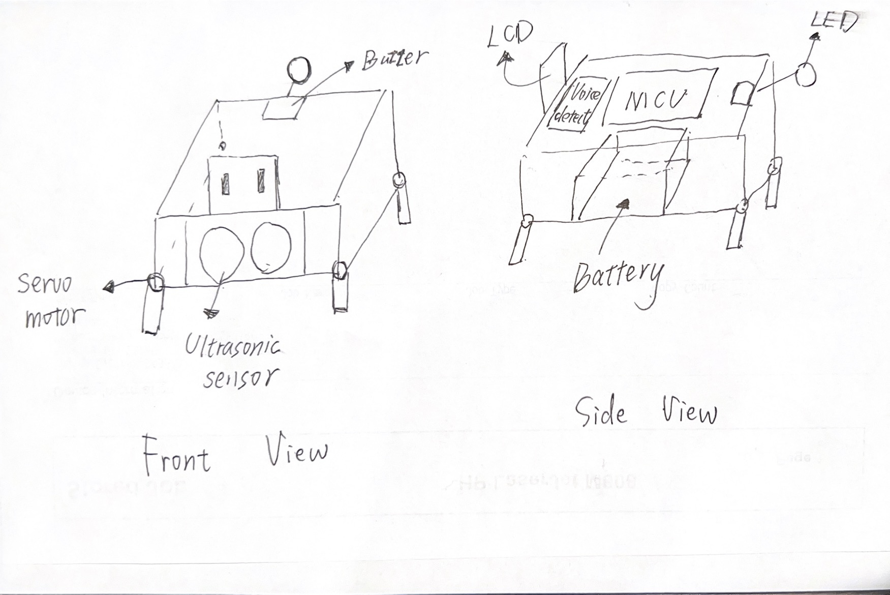
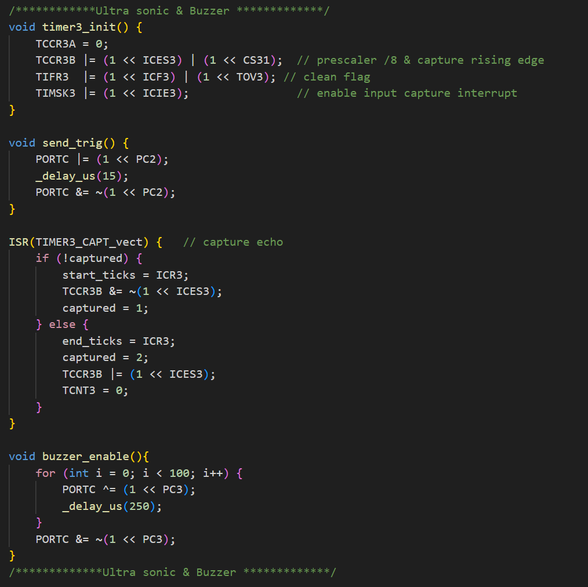
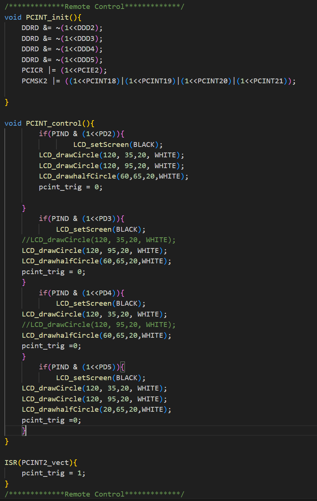
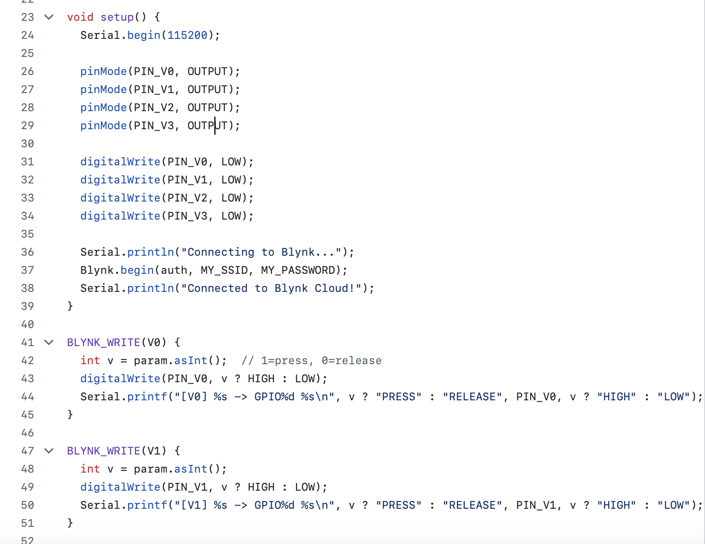
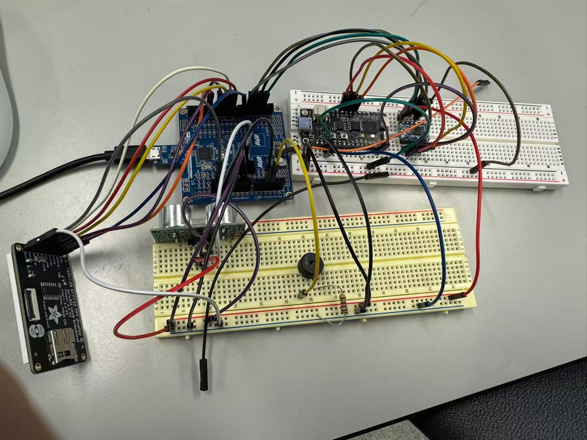

# final-project-skeleton

**Team Number:8**

**Team Name:G Square**

| Team Member Name | Email Address             |
| ---------------- | ------------------------- |
| [Yubin Guan]     | [guan1@seas.upenn.edu]    |
| [Shengge Guan]   | [shengge@seas.upenn.edu]  |
| [Haoliang Xie]   | [liang027@seas.upenn.edu] |

**GitHub Repository URL:https://github.com/upenn-embedded/final-project-website-submission-f25-t08-f25-g_square.git**

**GitHub Pages Website URL:https://upenn-embedded.github.io/final-project-website-submission-f25-t08-f25-g_square/** 

## Final Project Proposal

### 1. Abstract

Smart Dog is a voice-controlled robotic companion that performs actions such as sitting, walking, and turn around in response to user commands. It uses an ATmega328PB microcontroller for motion control, a voice recognition module for command receiving, an ultrasonic sensor for obstacle detection, and an ESP32 module for IoT connectivity via Blynk. An LCD displays expressions and system status, while LEDs and a buzzer provide feedback, demonstrating real-time interaction and embedded system integration.

### 2. Motivation

Problem:
Many people, especially those living alone, experience feelings of loneliness or a lack of companionship at home. While pets can provide emotional comfort, they require significant care, maintenance, and cost. Traditional robotic toys, on the other hand, often lack interactivity and emotional engagement, making them less appealing as long-term companions.

Interesting Because:
Smart Dog offers a playful yet meaningful solution by acting as an intelligent robotic companion that responds to voice commands and displays emotions through movement and expressions. Inspired by characters like Doraemon, it aims to bring joy, comfort, and a sense of presence to users through interactive behavior and personality. The project combines embedded systems, sensors, and IoT technology to create a lifelike, friendly robotic pet that interacts naturally with people.

Intended Purpose:
The goal is to design a voice-interactive robotic dog that can entertain, accompany, and emotionally engage users, particularly those living alone. By simulating the behaviors and reactions of a real pet, Smart Dog provides companionship without the responsibilities of pet care—offering a fun, educational, and comforting experience that brightens everyday life.

### 3. System Block Diagram

*Show your high level design, as done in WS1 and WS2. What are the critical components in your system? How do they communicate (I2C?, interrupts, ADC, etc.)? What power regulation do you need?*

### 4. Design Sketches

*What will your project look like? Do you have any critical design features? Will you need any special manufacturing techniques to achieve your vision, like power tools, laser cutting, or 3D printing?  Submit drawings for this section.*

### 5. Software Requirements Specification (SRS)

**5.1 Overview**
Smart Dog is a voice-interactive robotic companion. The software ingests inputs from a voice-recognition module, distance sensors and battery monitoring; drives outputs including multiple PWM-controlled servos, LEDs, a buzzer, and an LCD; and exchanges commands over ESP32 and Blynk. It processes sensor streams, applies state-machine logic, and provides real-time feedback locally and remotely.

**5.2 Definitions, Abbreviations**

ATmega328PB:
A microcontroller that functions as the primary control unit of the system. It manages the coordination of all hardware components by driving output devices—such as servos, LEDs, and buzzers, while simultaneously collecting and processing data from various sensors.

ESP32:
A high-performance microcontroller featuring built-in Wi-Fi connectivity. It extends the system's capabilities by enabling IoT functionality, including wireless data transmission, remote command control, and cloud-based monitoring.

Blynk IoT:
A cloud-based IoT platform that provides real-time monitoring and control of the system through mobile and web interfaces. It enables users to observe system status, send commands, and visualize sensor data conveniently and intuitively.

SRS: Software Requirements Specification

PWM (Pulse Width Modulation):
A technique used to control the output power delivered to electrical devices by adjusting the width of digital pulses. It is commonly applied for precise servo motor positioning and for modulating the brightness or intensity of LEDs and buzzers.

**5.3 Functionality**

| ID     | Description                                                                                                                                                                                                                                                                                                    |
| ------ | -------------------------------------------------------------------------------------------------------------------------------------------------------------------------------------------------------------------------------------------------------------------------------------------------------------- |
| SRS-01 | The voice recognition module will continuously listen for predefined commands and send recognized data to the ATmega328PB via UART every second. The command will be verified against the stored command set, and corresponding actions will be triggered immediately.                                         |
| SRS-02 | The ultrasonic sensor will measure the distance in front of the robot every 200 ms and send the data to the ATmega328PB. If an obstacle is detected within 15 cm, the robot will automatically stop movement and trigger the buzzle to emit a warningsignal.                                                   |
| SRS-03 | The LCD display will update every second to show an expressive facial animation corresponding to the robot’s current action. Each motion command (such as "sit", "walk" and "stop") will trigger a unique facial expression, allowing the robot to visually convey its behavior and enhance user interaction. |
| SRS-04 | The ESP32 module will transmit system telemetry (command, motion state and obstacle data) to the Blynk IoT platform every 2 seconds, allowing remote monitoring and basic control through the mobile app.                                                                                                      |

### 6. Hardware Requirements Specification (HRS)

**6.1 Overview**
The system recognizes voice commands and controls multiple servo motors to perform actions such as sitting, walking, and shaking hands. The ATmega328PB microcontroller manages sensor inputs and actuator outputs, while an ultrasonic sensor detects nearby obstacles to ensure safe movement. When an obstacle is detected, the buzzer and LEDs activate to warn the user. An LCD display shows facial expressions that match each action, enhancing interaction and feedback. The ESP32 provides IoT connectivity through the Blynk platform for remote monitoring and control. A Li-ion battery with voltage regulation supplies stable power for both the microcontroller and servos, enabling reliable and responsive operation.

**6.2 Definitions, Abbreviations**
ATmega328PB: A low-power microcontroller used as the main control unit to manage servo motors, sensors, LEDs, buzzer, and communication with the ESP32 module.

ESP32: A Wi-Fi-enabled microcontroller used to provide IoT connectivity, enabling wireless data transmission and remote monitoring through the Blynk platform.

Servo Motor: A motor with positional feedback controlled via PWM signals, used to move the robotic dog's legs and perform actions such as sitting or walking.

Ultrasonic Sensor: A distance sensor that emits ultrasonic waves to detect obstacles in front of the robot, ensuring collision avoidance during motion.

LCD: Liquid Crystal Display used to show expressive facial animations and system status feedback to the user.

Buzzer: An audio output device that produces alert tones when commands are recognized or obstacles are detected.

Li-ion Battery: A rechargeable power source that supplies stable voltage to both logic and motor circuits through an onboard regulator.

LED Indicator: A light-emitting component used to indicate the robot's operational states such as Idle, Active, or Error.

**6.3 Functionality**

| ID     | Description                                                                                                                                                                                                     |
| ------ | --------------------------------------------------------------------------------------------------------------------------------------------------------------------------------------------------------------- |
| HRS-01 | A voice recognition module shall detect predefined commands and send data to the microcontroller via UART. Recognized commands shall trigger corresponding physical actions such as "sit", "walk" and "stop".   |
| HRS-02 | Four servo motors shall be used to perform limb movements. The servos shall receive PWM control signals from the microcontroller and operate smoothly with position accuracy within ±2°.                      |
| HRS-03 | An ultrasonic sensor shall measure the distance to obstacles in front of the robot. If an object is detected within 15 cm, the system shall stop motion and activate the buzzer and LED indicators for warning. |
| HRS-04 | An ESP32 module shall provide IoT connectivity through the Blynk platform, allowing remote monitoring and simple control via a mobile application.                                                              |
| HRS-05 | A LCD display shall show expressive facial animations corresponding to the current action, providing visual feedback to the user.                                                                               |

### 7. Bill of Materials (BOM)

[BOM_URL](https://docs.google.com/spreadsheets/d/1_WICdXbaV3NPiHmyL6PZ5YQYJjqEtyZ5ZmHSeoKttjg/edit?usp=sharing)

ATmega328PB
https://www.digikey.com/en/products/detail/microchip-technology/ATMEGA328PB-XMINI/5338500
Serves as the main controller for the Smart Dog, handling servo control, sensor data processing, voice command interpretation, and coordination with peripheral devices.

ESP32
https://www.adafruit.com/product/5000
Provides Wi-Fi connectivity for IoT functions, enabling wireless communication with the Blynk platform for real-time monitoring and control.

LCD Display (16×2 or 1.8”)
https://www.adafruit.com/product/358
Used to display facial expressions and current status such as recognized commands, movement state, and obstacle detection alerts.

Voice Recognition Module (Elechouse VR3)
https://www.elechouse.com/product/speak-recognition-voice-recognition-module-v3/
Recognizes predefined voice commands (e.g., "sit", "walk" and "stop") and sends command data to the ATmega328PB for execution.

Ultrasonic Sensor (HC-SR04)
https://www.adafruit.com/product/3942
Detects obstacles in front of the robot to prevent collisions and ensures safe movement during walking or turning.

Servo Motors (SG90 × 4)
https://www.digikey.com/en/products/detail/dfrobot/SER0047/11613069
Provide motion for the dog's legs, enabling actions such as sitting, standing, walking, and shaking hands. Controlled via PWM signals from the microcontroller.

Buzzer and LED Indicators
https://www.adafruit.com/product/160
Used to provide audible and visual feedback. The buzzer signals successful command recognition or obstacle warnings, while LEDs indicate system states.

Li-ion Battery with Voltage Regulator (5V/3.3V)
https://www.adafruit.com/product/259
Supplies stable power to the microcontroller, servos, and sensors, ensuring consistent performance and safe operation.

### 8. Final Demo Goals

On demo day, the Smart Dog will be shown as a small, table-top or floor-based robotic pet that can respond to basic voice commands such as "sit", "walk" and "stop".
The demonstration will take place indoors on a flat surface with enough room for short movements. When the user gives a voice command, the dog will perform the matching action using its servo-driven legs.
If an obstacle is placed in front of it, the ultrasonic sensor will detect it and make the buzzer sound while an alert message appears on the LCD. The LCD will also change its "facial expression" according to each action, such as smiling when walking or blinking when sitting.
The Blynk app will be used to control Smart Dog's movement.
The goal of the demo is to highlight voice control, safe motion, and interactive feedback, showing how Smart Dog can act as a friendly and responsive robotic companion.

### 9. Sprint Planning

*You've got limited time to get this project done! How will you plan your sprint milestones? How will you distribute the work within your team? Review the schedule in the final project manual for exact dates.*

| Milestone  | Functionality Achieved                                                                                                                             | Distribution of Work                                                                               |
| ---------- | -------------------------------------------------------------------------------------------------------------------------------------------------- | -------------------------------------------------------------------------------------------------- |
| Sprint #1  | Build the basic frame and body of the dog. Make sure the main board (ATmega328PB and ESP32) can power on correctly.                                | Shengge Guan and Yubin Guan work on the frame design, another connects the power and basic wiring. |
| Sprint #2  | Attach and test the legs with servo motors. Make the motors move using simple PWM control.                                                         | Haoliang Xie assembles the legs, another writes test code for servo movement.                      |
| MVP Demo   | Combine all main functions: voice control, obstacle detection, and servo movement. The dog can respond to commands like "sit", "walk" and "stop". | All of us focus on coding and debugging, another tests sensors and motion performance.             |
| Final Demo | Final assembly and decoration. Show the Smart Dog performing all actions smoothly and responding to voice commands during presentation.            | Everyone helps test, polish the design, and prepare for the final demonstration.                   |

**This is the end of the Project Proposal section. The remaining sections will be filled out based on the milestone schedule.**

## Sprint Review #1

### Last week's progress

1.Finalized the system design, decided to use I2S and the ESP32 for voice recognition control.
2.Confirmed the final BOM, and placed the component orders.
[BOM_URL](https://docs.google.com/spreadsheets/d/1_WICdXbaV3NPiHmyL6PZ5YQYJjqEtyZ5ZmHSeoKttjg/edit?usp=sharing)

3.Finished obstacle detaction module, including distance detection, using ultrasonic sensor and buzzer output using GPIO.

Here is the test video. [V1](https://drive.google.com/file/d/1QEzGyKA6q07YDeCWrCVyDItsOuk85RAy/view?usp=drive_link)
4.Implemented Blynk IoT control to update the LCD display wirelessly.

Here is the test video. [V2](https://drive.google.com/file/d/1hmgXdJ_Aq2N5CC_ZZR76vhF3Y612nA34/view?usp=drive_link)
5.Learned and tested PWM driver for generating PWM signal.
Here is a test video for servo motor. [V3](https://drive.google.com/file/d/1ltSjVJelt76GrpAemyXRgJaPKcejDdZt/view?usp=sharing)

### Current state of project

We are currently in the modular design phase of the project.
During this week, we finalized the designs for both the obstacle detection, LCD control via Blynk modules and tested the PWm driver for generating the PWM signals.
These modules integrate sensor input acquisition, SPI-based LCD communication, and wireless control functionality through the Blynk.
Although all necessary components have been ordered, the hardware has not yet arrived, and testing will begin once they are delivered.

### Next week's plan

Next week, we will begin with the servo motor movement design. The goal is to develop four basic motion patterns for the smart dog’s legs, which will take approximately 1–2 days to complete. This task will be mainly carried out by Shengge Guan.
Following that, we will work on the I2S-based voice recognition module, which is expected to take about two days. In this stage, Yubin Guan and Haoliang Xie will collaborate to design the voice input system using a microphone to collect audio signals, process them through the ESP32 via I2S, and send corresponding control commands to the MCU to drive the motors.
Finally, we plan to integrate an IMU module to enable motion detection and feedback for the smart dog. This task will also take around two days and will be completed jointly by all three team members. The IMU data will be used to monitor the dog’s movements and displayed in real time on the Blynk IoT.

## Sprint Review #2

### Last week's progress

1. Finished voice recognition module, using ADC and MEMS microphone. We used the numbers of clap to decide which operation to be executed. Here is our test video. [voice_recognition](https://drive.google.com/file/d/14UPAd-8kFQAw4NirMjw4hy5HUUOzlmQn/view?usp=sharing)
2. Achieved the fall detection using IMU. If fall is detected , it will display the notificaiton on the serial port and send a warning email through Blynk.Here is our test video.  [imu test](https://drive.google.com/file/d/1mvDIs80K44RiORAFi_pqH8paCEGQ9gF1/view?usp=sharing)
3. Realized the coordinated control of four servos, but we stiil to test it when all the hardwares are assembled.
   All the individual codes can be found in the [repo](https://github.com/upenn-embedded/final-project-f25-f25-final_project-g_square/tree/main/Final_project.X).

### Current state of project

We have now completed the core functional modules of the smart dog: Obstacle Detection, LCD Control (via Blynk), Basic Motor Control (I2C for driver + PWM), Motion Feedback (IMU/Fall Detection), and a functional Voice Control Prototype(ADC+ microphone).
All modular designs are functionally complete and individually tested. The main remaining challenge is the full integration of these modules into a single, cohesive codebase.

### Next week's plan

1. Integrate the code together, especially the voice recognition part (We will still try the I2S module with ESP32 to achieve it. Shengge Guan will be responsible for it and will spend 1 day). All teammates will work together to debug the main file.
2. Design the frame of the dog and assemble all the hardwares. Haoxiang Xie and Yubin Guan will work on it and probably will take 2 days to finish.

## MVP Demo
Here is our [slide](https://docs.google.com/presentation/d/1iUWWygRvbU7vrjxkWwl4zu8MAuMKIwlo/edit?usp=sharing&ouid=113835531455249857774&rtpof=true&sd=true).  
1. Show a system block diagram & explain the hardware implementation.
2. Explain your firmware implementation, including application logic and critical drivers you've written.
3. Architecture Overview：
   The system employs a dual-microcontroller architecture. The ATmega328PB serves as the primary control unit for motion, sensors, and feedback , while the ESP32 acts as a co-processor to handle capls number recogbition, Wi-Fi connectivity and IoT communication with the Blynk platform.
4. Application Logic:
   Clap Detection & Control: The ESP32 continuously samples the microphone. It counts the number of claps detected within a specific time window to determine the desired action (e.g., 1 clap = sit, 2 claps = walk) and transmits the command to the ATmega328PB.
   Safety & Avoidance: The ultrasonic sensor is polled every 200 ms. If an obstacle is detected within 15 cm, the system overrides the current state to stop movement and triggers the buzzer.
   System Feedback: The LCD updates every second to display "facial expressions" matching the current action, and the ESP32 transmits telemetry data to the mobile app every 2 seconds.
   Tilt Monitoring: An IMU continuously measures the dog's inclination. If the tilt angle exceeds a set threshold, the system sends a warning alert to the Blynk app via the ESP32 to indicate potential instability.
5. Critical Drivers:
   PWM Driver: Generates precise pulse signals to control the four servo motors
   IMU Driver: Interfaces with the sensor to capture 3-axis acceleration data with 16-bit depth every 100 ms for stability analysis.
   Ultrasonic Sensor Driver: Handles the timing logic required to measure distance for collision prevention.
   LCD Driver: Controls the display interface to render animations corresponding to the robot's behavior.
   Audio Processing Driver (ESP32): Implements signal processing algorithms to filter noise, detect peaks (claps), and count occurrences to trigger state changes.
6. Demo your device.
7. Have you achieved some or all of your Software Requirements Specification (SRS)?

   | ID     | Description                                                                                                                                                                                                                                                                                                    |
   | ------ | -------------------------------------------------------------------------------------------------------------------------------------------------------------------------------------------------------------------------------------------------------------------------------------------------------------- |
   | SRS-01 | The mirophone module will continuously listen for the claps and identify the numvber, then send recognized data to the ATmega328PB . The command will be verified against the stored command set, and corresponding actions will be triggered immediately.                                                     |
   | SRS-02 | The ultrasonic sensor will measure the distance in front of the robot every 200 ms and send the data to the ATmega328PB. If an obstacle is detected within 15 cm, the robot will automatically stop movement and trigger the buzzle to emit a warningsignal.                                                   |
   | SRS-03 | The LCD display will update every second to show an expressive facial animation corresponding to the robot’s current action. Each motion command (such as "sit", "walk" and "stop") will trigger a unique facial expression, allowing the robot to visually convey its behavior and enhance user interaction. |
   | SRS-04 | The ESP32 module will transmit system telemetry (command, motion state and obstacle data) to the Blynk IoT platform every 2 seconds, allowing remote monitoring and basic control through the mobile app.                                                                                                      |
   | SRS-05 | The IMU module shall continuously measure and fuse 3-axis acceleration, which must be sent to the ATmega328PB through I2C for motion stabilization. If either angle exceeds the warning number, an immediate Emergency Stop command will be triggered. |
   

   1. Show how you collected data and the outcomes.
8. Have you achieved some or all of your Hardware Requirements Specification (HRS)?

   | ID     | Description                                                                                                                                                                                                     |
   | ------ | --------------------------------------------------------------------------------------------------------------------------------------------------------------------------------------------------------------- |
   | HRS-01 | The ESP-32 would measure the number of the claps through a microphone and send data to the microcontroller. Recognized numbers shall trigger corresponding physical actions such as "sit", "walk" and "stop"  |
   | HRS-02 | Four servo motors shall be used to perform limb movements. The servos shall receive PWM control signals from the microcontroller and operate smoothly with position accuracy within ±2°.                      |
   | HRS-03 | An ultrasonic sensor shall measure the distance to obstacles in front of the robot. If an object is detected within 15 cm, the system shall stop motion and activate the buzzer and LED indicators for warning. |
   | HRS-04 | An ESP32 module shall provide IoT connectivity through the Blynk platform, allowing remote monitoring and simple control via a mobile application.                                                              |
   | HRS-05 | A LCD display shall show expressive facial animations corresponding to the current action, providing visual feedback to the user.                                                                               |
   | HRS-06 |An IMU sensor shall be integrated to measure 3-axis acceleration. This module shall communicate with the microcontroller via the I2C bus and must be capable of providing raw data to support real-time motion stabilization.|
   

   1. Show how you collected data and the outcomes.
9. Show off the remaining elements that will make your project whole: mechanical casework, supporting graphical user interface (GUI), web portal, etc.
10. What is the riskiest part remaining of your project?
    the structural integrity of the servo motor mounts. Since the servos must support the robot's weight and generate movement, there is a high risk that the motors could detach or shift from the frame due to torque and vibration during operation, leading to mechanical failure.

    1. How do you plan to de-risk this?
       We will design or modify 3D-printed brackets that tightly fit the servo motors to prevent wiggling or detachment.
11. What questions or help do you need from the teaching team?
    We currently do not have the access to raser lab, so we could not do the 3d printing.

## Final Project Report

### 1. 🎥 Video

[video_url](https://drive.google.com/file/d/1ecHt0VyD5tAkqrYCpK-P9USukw_RQf4E/preview)

### 2. 📸 Images

  

  

  

  

  

### 3. 🎨 System Block Diagram

  

### 4. 🤔 Results
Since suitable speech-recognition libraries were unavailable and the ESP32 did not have enough memory for audio processing, we replaced word control with a clap detection module. The microphone listens for claps, identifies the pattern, and sends the corresponding motion(stand, prone, forward and backward) to the ATmega328PB.  
The dog also uses an ultrasonic sensor to detect nearby obstacles; if something is closer than 20 cm, the robot stops and activates a warning buzzer. An LCD display updates every second to show facial expressions that represent the dog's current action, such as walking and sitting.  
The ESP32 provides remote-control capability by sending system commands to the Blynk IoT platform. In addition, the IMU continuously measures acceleration, and if it detects movement beyond a safe threshold, the system triggers an emergency stop.  
#### 4.1 Software Requirements Specification (SRS) Results

| ID     | Description | Validation Outcome |
|--------|-------------|-------------------|
| SRS-01 | The microphone module shall continuously listen for claps and identify the number, then send recognized data to the ATmega328PB. The command shall be verified against the stored command set and corresponding actions will be triggered immediately. | Confirmed via live testing and [video evidence](https://drive.google.com/file/d/1LQzFO7CN_q8gTajt9GSfTH_k3eMAXigI/view?usp=share_link). |
| SRS-02 | The ultrasonic sensor shall measure the distance every 1 s. If an obstacle is detected within 20 cm, the robot stops movement and triggers the buzzer to emit a warning signal. | Confirmed via live testing and [video evidence](https://drive.google.com/file/d/1dD9kHc6z8SWlcGxx0egVHsm26H7kbpge/view?usp=share_link). |
| SRS-03 | The LCD display shall update every second to show facial emotions corresponding to the robot’s current action (e.g., sit, walk, stop). | Confirmed via live testing and [video evidence](https://drive.google.com/file/d/1LQzFO7CN_q8gTajt9GSfTH_k3eMAXigI/view?usp=share_link). |
| SRS-04 | The ESP32 shall transmit system command to the Blynk IoT platform for remote control. | Confirmed via live testing and [video evidence](https://drive.google.com/file/d/1LEdqjWzvrj9qv65okmgKJJLJmY1vXym9/view?usp=share_link) |
| SRS-05 | The IMU shall continuously measure 3-axis acceleration and send data to the ATmega328PB via I2C. When the acceleration exceeds a predefined threshold, 
the system shall issue a email alert via the IoT platform. | Confirmed via [video evidence](https://drive.google.com/file/d/1asGX6gRP8TG-OgkCPrwq0DiNiOpHG6Pe/view?usp=share_link) and [serial output](https://github.com/upenn-embedded/final-project-website-submission-f25-t08-f25-g_square/blob/main/imutest.jpg). |

#### 4.2 Hardware Requirements Specification (HRS) Results

| ID     | Description | Validation Outcome |
|--------|-------------|-------------------|
| HRS-01 | The ESP32 shall measure the number of claps using a microphone and send the recognized count to the microcontroller. Each number triggers a physical action such as sit, walk, or prone. | Partially confirmed via live testing and [video evidence](https://drive.google.com/file/d/1LQzFO7CN_q8gTajt9GSfTH_k3eMAXigI/view?usp=share_link). Clap recognition and command triggering were validated, but the walking motion was limited by mechanical design and low friction between foot and ground.|
| HRS-02 | Four servo motors shall be used to perform limb movements. The servos receive PWM control signals from the microcontroller and operate smoothly with a positional accuracy of ±2°. | Confirmed via live testing and [video evidence](https://drive.google.com/file/d/1LQzFO7CN_q8gTajt9GSfTH_k3eMAXigI/view?usp=share_link). |
| HRS-03 | An ultrasonic sensor shall measure the distance to obstacles in front of the robot. If an object is detected within 20 cm, the system stops motion and activates the buzzer. | Confirmed via live testing and [video evidence](https://drive.google.com/file/d/1dD9kHc6z8SWlcGxx0egVHsm26H7kbpge/view?usp=share_link). |
| HRS-04 | The ESP32 shall provide IoT connectivity through the Blynk platform, enabling remote basic control via a mobile application. | Confirmed via live testing and [video evidence](https://drive.google.com/file/d/1LEdqjWzvrj9qv65okmgKJJLJmY1vXym9/view?usp=share_link) |
| HRS-05 | The LCD display shall show expressive facial emotions corresponding to the robot’s current action, providing visual feedback to the user. | Confirmed via live testing and [video evidence](https://drive.google.com/file/d/1LEdqjWzvrj9qv65okmgKJJLJmY1vXym9/view?usp=share_link) |
| HRS-06 | An IMU sensor shall measure 3-axis acceleration and communicates with the microcontroller via I2C. | Confirmed via [video evidence](https://drive.google.com/file/d/1asGX6gRP8TG-OgkCPrwq0DiNiOpHG6Pe/view?usp=share_link) and [serial output](https://github.com/upenn-embedded/final-project-website-submission-f25-t08-f25-g_square/blob/main/imutest.jpg). |

### 5. ✍️ Conclusion

  <h3>Yubin</h3>
  

    From the final project, I learned how to programme communication protocols and integrate
    multiple modules. I was responsible for IMU programming and system integration.
    While individual modules worked well, integration introduced challenges.
  

  

    Initially, we used an ADC-based microphone on the ATmega, which worked in isolation
    but failed once the ultrasonic sensor, IMU, and buzzer were added.
    After consulting with the TA, we switched to an I2S-based solution using ESP32.
    We later identified blocking delays as the main issue and resolved it using timers.
  

  

    In the future, we plan to improve motion smoothness and revisit voice-recognition
    control using spoken commands.
  

  <h3>Haoliang</h3>
  

    I learned how to use a mircophone to detect the voice information using I2S protocol, and leverage it to 
    control the LCD and servo motors. Also, I have known better about the bare metal program. It is kind of overwhelmed 
    when we use it to tackle a lot of tasks. So next time I may use RTOS instead of bare metal. For me, the ultra sonic
    and the LCD works well. I am proud of the voice control, which recognizes the number of claps as orders and the cooperation
    of the four servo motors. I think the walking motion could have been done differently since we could produce another PWM to 
    drive the motors or stick something to the legs to enhance the friction if we have one more day. One obstacle is that it was 
    harder than we thought to use "words" to control the dog. After we tried two ways, we gave it up and chose the claps. But on 
    the Demo day I saw another team had sucessfully implemented the function. I asked them and they told me that they used a 
    voice module which they found in Dektin. So next time we should explore the Detkin carefully. For the next step, I think 
    we can try a different PWM to drive the motors to see if the legs can sucessfully move the body, or enhancing some friction.
  

  <h3>Shengge</h3>
  

    From this final program, I have learned much more about the I2C and I2S protocols and gained a comprehensive understanding of how to integrate different modules of code. I was responsible for 3D printing, ESP32 modeling, and the PWM generator. I also learned more about servo motors and how to use Arduino for voice recognition.At the beginning, we planned to use the ATmega328PB for voice recognition through the ADC. However, after integrating the code, we found a significant delay, which prevented us from achieving our goals. Therefore, we decided to use a microphone connected to the ESP32 and performed voice recognition on the ESP32 instead. This greatly reduced the delay in the overall system.One of the challenges we encountered was measuring the size of the servo motors because no dimensional information was provided in the datasheet. As a result, the hole size in our 3D-printed model did not match the servo motor dimensions. We had to use tape to wrap the motor to ensure it remained stable. In the next step, we could design and 3D-print a more realistic leg for our robot dog. We could also create a more suitable frame to eliminate the need for tape and improve overall stability.
  

## References
UART library  
LCD library (Lab 4 Pong).
